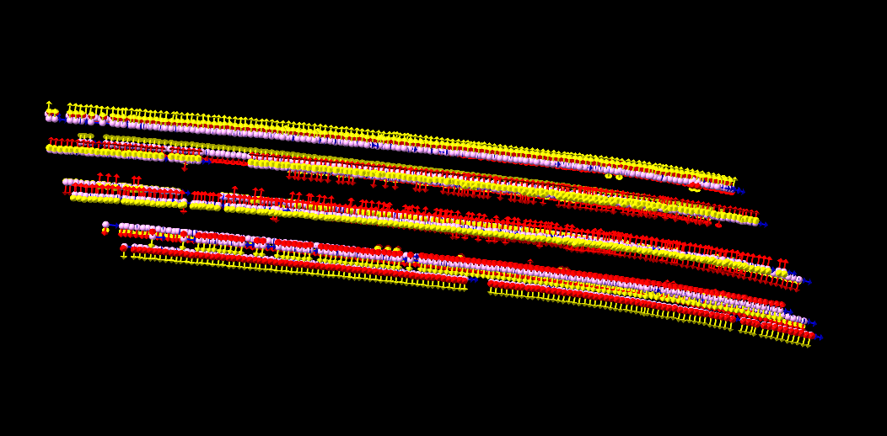
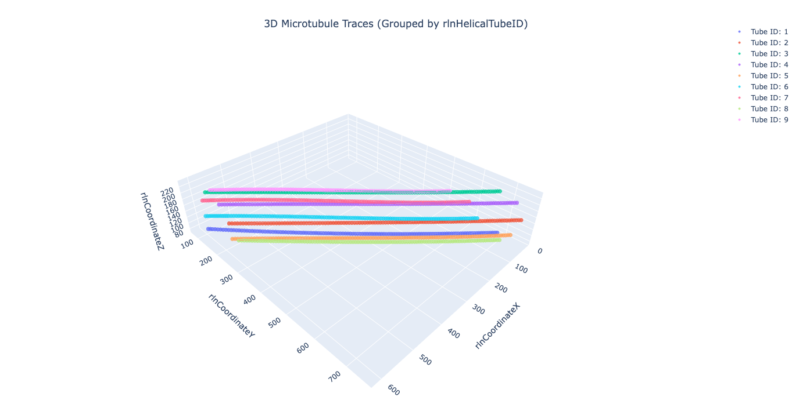

# CRYOET_MTFIT

Contributors: Huy Bui, Molly Yu, Zhiling Zhou

## Introduction

Line fitting based on 3D template matching of filaments (MT).  

The program will fit lines on the scatter points in the 3D template matching of microtubules. It works using several step:

**Step 1. Fit:** Find seeds and extend the line to fit lines and resample dense points

**Step 2. Clean:** Clean duplicate lines due to duplicate/overlapped points when template matching with optional clean using Psi angle.

**Step 3. Connect:** Connect lines that are likely part of a long line and resample the lines with the desired periodicity.

**Step 4. Predict:** Use the template matching angles to predict the initial angle for the new connected line. This is particularly useful for ciliary microtubules as it predicts very well the polarity and initial rotational angle.

Extra function (Future): 
- For tomograms with only 1 cilia, it can automatically reorder the doublet microtubule number in the same conventional order of cilia cross-section.
- Initial angle assignment based on specific helical property.

Potentially, the program can be used for other filaments, which are more straight and can easily be described by a polynomial of order 3. For more flexible filaments, perhaps a future implementation of 'spline' interpolation instead of polynomial fitting might work better.

**Acknowledgement::**

Some codes and ideas are based on:   [https://github.com/PengxinChai/multi-curve-fitting](https://github.com/PengxinChai/multi-curve-fitting)

**Note:** The code is not yet fully done or tested.

---

## INSTALLATION
_To be added._

---

## USAGE

### Initial Fit
```bash
mt_fit.py fit CCDC147C_001_particles.star --angpix 14 --sample_step 82 --min_seed 6
```

Note: Increase the min_seed to 6 is a lot cleaner than 5 but might ignore some MTs

### Clean duplicate
```bash
mt_fit.py clean CCDC147C_001_particles_fitted.star --angpix 14 --dist_thres 50 --psi_min 30 --psi_max 150
```

--direction_angle, --direction_dev
--psi_min,--psi_max range of angle between (0 & 180) to keep. Use 30-150 to eliminate horizontal particles, bad in cryo-ET.

### Connect lines
```bash
mt_fit.py connect CCDC147C_001_particles_fitted_cleaned.star --dist_extrapolate 1500 --angpix 14 --min_seed 5 --overlap_thres 80 --sample_step 82 --min_part_per_tube
```

To allow connect far apart tubes, increase the --dist_extrapolate to 3000 and --overlap_thres to 200

### Predict
```bash
mt_fit.py predict CCDC147C_001_particles_fitted_cleaned_connected.star --angpix 14 --template CCDC147C_001_particles.star --neighbor_rad 100 --max_delta_degree 15
```

### One commandline for all
```bash
mt_fit.py pipeline CCDC147C_001_particles.star --angpix 14 --sample_step 82 --min_seed 6 --poly_order 3 --dist_thres 50 --dist_extrapolate 2000 --overlap_thres 100 --neighbor_rad 100 --template CCDC147C_001_particles.star 
```

## USING INSIDE CHIMERAX
Open ChimeraX with ArtiaX, load your template matching star file.




For now, we would use it like this by typing in the command windows of ChimeraX:
```bash
cd ~/Documents/GitHub/CryoET_MTCurveFit/scripts
runscript mtfitchimerax.py #1.2.1 voxelSize 14 sampleStep 82 minseed 6 poly 3 cleanDistThres 50 distExtrapolate 2000 overlapThres 100 minPart 5 neighborRad 100
```

## VISUALIZING RESULTS
You can use ChimeraX with ArtiaX installed to visualize star files. On the other hand, you can use our simple star visualizer

### Visualize initial fit
```bash
view_star.py CCDC147C_001_particles.star
```


### View final results
```bash
view_star.py CCDC147C_001_particles_processed.star
```

### Or write out if running from a server
```bash
view_star.py --output final.html CCDC147C_001_particles_processed.star
```




